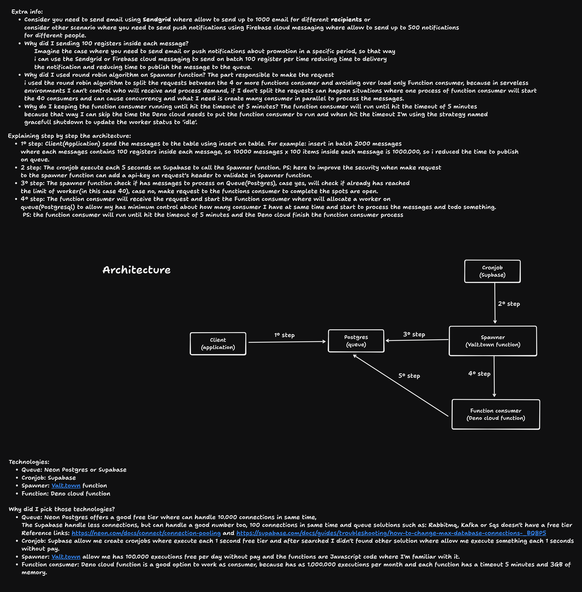

## Scenario

- Image a scenario where you need to create a system to process 1000000 messages and send email or push notification to the user and you can spend up to 10 minutes to process all messages. But you need to create a system that can handle this load and spend $5 dollars or less, the best can spend $0 dollars.

## ABOUT

The project has focus to implement the solution to resolve the scenario I described above.

## Technologies

- Client application
    - Node.js
    - TypeScript
    - Postgresql(queue). PS: using Neon postgres free tier.
- Cronjob
    - Supabase cronjob feature. PS: free tier
- Spawner
    - Deno + Valtown functions. PS: using free tier plan where allow me execute 100000 functions per day.
    - Postgresql(queue). PS: using Neon postgres free tier.
- Function consumer
    - Deno + Deno cloud functions. PS: using free tier plan where allow me execute 1000000 functions month and the functions has 5 minutes timeout and 3GB of memory.
    - Postgresql(queue). PS: using Neon postgres free tier.


## How to setup the queue

- Create a Neon postgresl account
- Create a project
- Use a postgres client to execute the **schema-queue.sql** file in root of project

## How to setup client-application

- Clone the repository
- Copy the .env.example to .env
- Fill the .env file with your data
- Run the following commands:
    - pnpm install
    - pnpm run publish

## How to setup spawner

- Create a Valtown account
- Create a Val(functions)
- Copy the code from **index.ts** in spawner folder
- Add the envs in Valtown based the .env.example file
- Copy the Val(function) url

## How to setup cronjob

- Create Supabase
- Access the integration page
- Search 'cronjob'
- Enable the cronjob
- Create a cronjob where will make request to spawner url. PS: setup the cronjob to each 5 seconds or adjust for the time you consider better for you.
- Active the cronjob. PS: if you want to 
stop the consumer you need only disable the cronjob, so the spawner will not make requests to function consumer.


## How to setup function consumer

- Create a Deno account
- Create a Deno cloud functions
- Copy the code from **index.ts** in function-consumer folder
- Add the envs in Deno based the .env.example file
- Copy the Deno cloud functions url
- Back to Val(function) and replace 'url_function_consumer_here' to the function consumer url. PS: execute the 'How to setup function consumer' 4 times to create 4 different functions, because that way the spawner can split the requests between the 4 functions consumers and distribute the load to execute in parallel instead concurrently.


## Architecture



Link of architecture diagram: https://www.tldraw.com/f/TuKxRceybAfK90YX1sHAv?d=v-659.-330.2903.1762.page


## How to make that solution more scalable?

- Queue(Postgres): you can upgrade the plan on Neon postgres to the Launch plan where you pay based what you use and the postgres will have more resource to handle more messages. PS: serveless pricing model
- Spawner(Deno + Valtown functions): you can upgrade the plan on Valtown to the Pro plan where you pay $8.33 dollar, the pricing I'm saying I checking while I'm writing the documentation, so you can have 1000000 executions per day
- Function consumer(Deno + Deno cloud functions): you can upgrade the plan on Deno to the Pro plan where you pay $20 dollar, the pricing I'm saying I checking while I'm writing the documentation, so you can have 5 million executions per month.

### WARNING

- After upgrade the plans to handle more executions, you need to do:
    - Insert more registers on table 'workers' on queue database to allow to have more 
    consumers to process the messages.
    - Create more function consumers to handle the load using 'How to setup function consumer' section.
    - Change the spawner queries to replace the value 40 to the number of workers you have now.
    - Change the spawer code line:
    ```js
      const totalWorkersStart = 40 - totalWorkersWorking.length; // replace 40 to number you have now.
    ```
    - Add the new function consumer url to the spawner code, so instead distribute only to 4 functions consumers will distribute for more functions consumers. 


